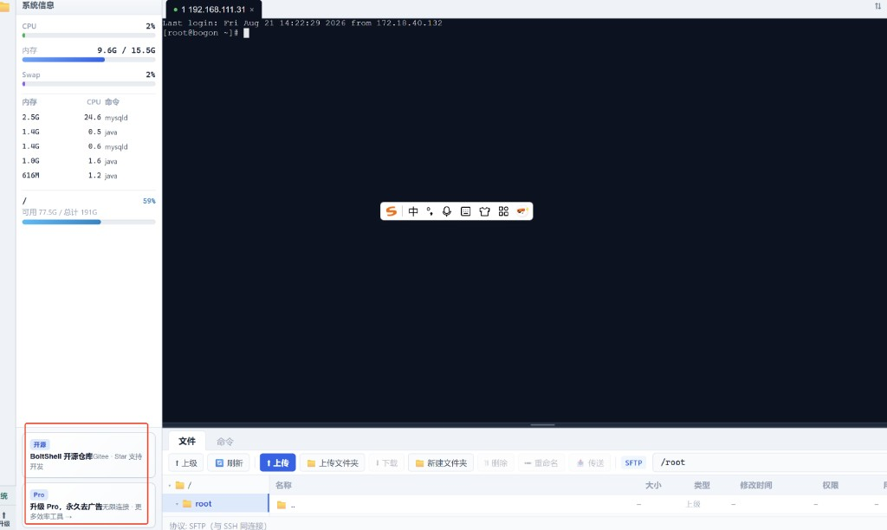

# BoltShell 竞品变现与广告风险调研

> 检索时间：2026-08-21 · 来源均为公开网页（文末附来源清单）
> 关联文档：[商业化与开源策略](BoltShell_商业化与开源策略.md) · [赞助位报价与市场参考](BoltShell_赞助位报价与市场参考.md) · [赞助位配置说明](BoltShell_赞助位配置说明.md) · [客户端赞助数据统计设计](BoltShell_客户端赞助数据统计设计.md)
> 目的：回答「市面上 SSH 工具有没有靠广告赚钱的」，并据此校准 BoltShell 的赞助位形态、刊例和收入结构。

---

## 一、结论先看

| 问题 | 答案 |
|------|------|
| 桌面 SSH 客户端有靠界面内第三方广告赚钱的吗？ | **基本没有**。有市场份额的桌面 SSH 客户端里，没查到一个在界面内投第三方广告 |
| 有广告的 SSH 客户端在哪？ | **移动端长尾**（鸿蒙 TermNext、Google Play 上百级下载的小 App），无一是头部 |
| 头部产品怎么赚钱？ | 付费授权 / 订阅（Termius、Xshell、MobaXterm、FinalShell），或赞助 logo（Tabby、electerm） |
| 「无广告」在这个品类是什么？ | **是竞品的宣传语**。Termius、Mobile SSH 直接把 `Ad-free` / `no ad banners on the terminal` 写进商店和官网首屏 |
| 开源终端卖赞助能卖多少？ | 公开档位是 **每月 35 / 100 / 135 / 400 美元** 级别（electerm、Tabby），不是想象中的大钱 |
| 更现实的收入主力是什么？ | **云厂商 CPS 返佣**（阿里云最高 35%、腾讯云 20%–35%）+ Pro 授权；展示型赞助位是补贴，不是支柱 |
| 最该躲的坑 | ① 安装包捆绑第三方 offer（FileZilla）② 命令行 / 终端区展示广告（npm 事件）③ 第三方广告 SDK |

**一句话：** 这个品类不是「没人想过放广告」，而是**放了的都在长尾，头部把「没广告」当卖点**——所以 BoltShell 的赞助位只能做成克制的自营 + 精选赞助，收入结构必须押在 Pro 授权和云厂商 CPS 上。

---

## 二、主流 SSH / 终端客户端的变现方式

| 产品 | 变现模式 | 界面内第三方广告 |
|------|----------|------------------|
| **Termius** | 订阅（Starter 免费 / Pro） | 无。商店描述把 **`Ad-free`** 列为免费版卖点之一 |
| **JuiceSSH** | Pro 一次性内购 | 无（社区长期公认 ad-free） |
| **FinalShell** | 免费基础 + 高级版付费（约 ¥128 买断量级） | 无第三方展示广告，只推自家加速服务与高级版 |
| **MobaXterm** | Home 免费 + Professional 付费 | 无广告，仅终端底部 `UNREGISTERED VERSION` 角标 |
| **Xshell / SecureCRT** | 授权收费 | 无 |
| **Tabby**（开源） | OpenCollective + GitHub Sponsors | 无。$100/月 `Corporate Sponsor` 只进 README 的 Sponsors 区 |
| **electerm**（开源） | GitHub Sponsors 分档 $35 / $135 / $400 每月 | 客户端内无；**阿里云 / 腾讯云的 CPS 优惠位全部放在官网赞助页** |
| **Mobile SSH** | 全免费 | 官网首屏原话：**No Pro tier, no ads … no ad banners on the terminal** |

**对 BoltShell 最关键的一条：** Termius 和 Mobile SSH 把「终端里没有广告横幅」写成明确卖点。这意味着一旦 BoltShell 的赞助位做得张扬，竞品对比文的现成标题就有了。反过来说，**赞助位越克制，这句话就越难被用来打我们**。

---

## 三、确实有广告的 SSH 客户端：全在移动端长尾

| 产品 | 广告形态 | 体量 |
|------|----------|------|
| **TermNext**（HarmonyOS SSH/Telnet） | 免费版展示广告 + 限制配置项数量；Advanced 版去广告并解锁端口转发等；接入华为鲸鸿动能广告 | 单平台新产品 |
| **SSH ADB Telnet Remote**（Google Play） | 商店标注 `Contains ads` + `In-app purchases`，一次性内购去广告 | **100+ 下载** |
| **Acode**（编辑器 + 终端） | 免费版广告，Pro 去广告 | 用户评论原话：广告实现「是我用过的所有 App 里最烂的」，并明确说**恶心的广告反而让人不想买 Pro** |

Acode 那条评论值得抄进产品红线：**广告体验差不只是掉口碑，它直接压低 Pro 转化率**——这跟我们「赞助位是 Pro 转化钩子」的设想是相反的方向。

---

## 四、邻近品类的三个教训（比 SSH 本身更有参考价值）

### 4.1 FileZilla —— 同一批用户，最直接的反面教材

官网主安装包捆绑第三方 offer（Avast、McAfee WebAdvisor、Opera 等），安装文件名带 `_sponsored_`：

- 被 VirusTotal 标为 adware，Windows Defender 报 `App:FileZilla_BundleInstaller` / `Win32/FileZilla_BundleInstaller`；
- Reddit、Hacker News 连续两轮炸锅（2018、2021），安全研究者公开建议「别用 FileZilla」；
- 官方反复解释「offer 全部可拒绝、官网还有 unbundled 干净安装包、Pro 版永远无广告」，**没能挽回口碑**；
- 大量用户永久迁到 WinSCP / Cyberduck / gFTP，且有人明确表示「连没有捆绑的 Linux 版也不用了」。

**教训：** 这不只是口碑问题——**杀软报毒会直接掐死下载转化**，而且解释成本无限高。

### 4.2 WinSCP —— 连「只有一屏广告」都扛不住

WinSCP 安装器从 2009 年起带 OpenCandy 一屏广告。作者最初的辩护是「这跟网站上挂 AdSense 有什么区别」，但在被 Defender 等安全软件报 adware 后，还是在 4.3.2 版本把 OpenCandy 移除了，理由就是**不想让用户收到安全告警**。

**教训：** 判定权不在我们手里。只要形态像广告分发，**杀软怎么标、用户怎么想，不由开发者解释算数**。

### 4.3 npm 终端广告事件 —— 开发者 + 命令行 + 广告 = 舆论最高档

2019 年 8 月，`standard` 14.0.0 引入 `funding` 包，在 `npm install` 时打一条赞助横幅（广告主是 Linode）：

- 社区当天就出现 `no-cli-ads`、`npm-adblock` 之类的屏蔽包；
- Linode 主动撤下广告，同时声明仍支持开源；
- npm 官方直接改政策：**禁止在运行时、安装时或任何 npm scripts 阶段展示广告的包**，也禁止「本身主要就是广告」的包；
- `core-js` 作者的 postinstall 求职信息也被 PR 移除，作者威胁「那就把消息挪到浏览器 console」，被社区回「这种态度会让你的库被 fork」。

**教训：** 这批人不是「看到广告有点烦」，而是**会写博客、发 HN、造屏蔽工具、推动平台改规则、然后换掉你**。BoltShell 的 `bolt` CLI 尤其要注意：**CLI 输出里永远不要出现赞助信息**，这是 npm 事件划出来的红线。

### 4.4 Bandizip / PotPlayer —— 工具软件加广告的标准结局

Bandizip 7.0 免费版加入主界面底部横幅 + 压缩解压完成后的弹窗，同时推出付费去广告的专业版（个人 $30 量级）。官方解释相当诚实：服务器和开发要成本、不想靠砍功能分版本，所以选了「非侵入式横幅」这条折中路。结果是：

- 一批老用户**永久停留在最后一个无广告版本 6.29**；
- 另一批直接转 7-Zip；
- 同公司的 PotPlayer 内置广告弹窗模块后遭遇同样的评价。

**教训：** 「非侵入式横幅」是开发者视角的说法。用户视角只有两档：**有广告 / 没广告**。

---

## 五、国内运维与远控工具：广告能赚钱，但代价是明确的

| 产品 | 做法 | 结果 |
|------|------|------|
| **宝塔面板** | 面板界面内大量付费横幅与推广按钮，底部长期挂「由尊云云服务器提供支持」 | 生意成立，但论坛「建议删除大部分付费广告横幅」这类帖子挂了数年（有回帖直接怼「你不让我恰饭了？」）。它是靠既有装机量硬扛口碑损耗 |
| **向日葵** | 免费版界面内嵌广告 + 功能限速 | 各类横评反复点名「广告频率高」「严重影响使用心情」 |
| **ToDesk** | 不加广告，改砍免费额度（每月连接次数 / 时长） | 2024-05 无预告上线 300 次 / 120 小时限制，2025 收紧到 200 次 / 80 小时，两次都被蓝点网等媒体和用户集中吐槽 |

**对照价值：** 宝塔证明了「运维工具内导流云服务器」是**能赚钱的成熟生意**；向日葵与 ToDesk 的对照则说明，这类工具**无论选广告还是选限额都会掉一层口碑**，区别只在掉在哪儿。我们已经选了「限免费连接数 5 台 + 克制赞助位」的组合，等于两边各取一点，那就更要求两边都别做过头。

---

## 六、开源终端的赞助价位（用来校准我们的刊例）

| 项目 | 公开档位 | 权益 |
|------|----------|------|
| **electerm** | **$35 / 月** | README + 官网小 logo + 链接 |
| | **$135 / 月** | 中号 logo |
| | **$400 / 月** | 大 logo + slogan + 描述 |
| | GitHub Sponsors 页面显示：目标 **$100/月**，累计 10 位赞助者 | — |
| **Tabby** | **$100 / 月** `Corporate Sponsor` | 公司 logo 进 Tabby Sponsors 区 |
| | OpenCollective：backer $5/月，sponsor $100/月，账面余额数百美元量级 | — |

**对我们刊例的含义：**

1. 我们在 [赞助位报价与市场参考](BoltShell_赞助位报价与市场参考.md) 里定的 `sidebar_1` **¥800～1500/月**、`quick_connect_bottom` **¥1200～2000/月**，换算后**高于** electerm 的 $135 档、接近 $400 档。理由站得住（**客户端内 > README/官网**，场景更近），但**必须用「场景内 + 精准运维人群」讲，不能用曝光量讲**。
2. 这些数字同时说明一件事：**独立 SSH 工具直接卖展示位，早期天花板就是每月几百到几千人民币**。这与商业化文档 §2.1 的粗算结论一致，不要指望它撑起项目。
3. electerm 的实际做法更值得抄：**客户端内保持干净，把阿里云 / 腾讯云的优惠位全部放到官网赞助页**。这是「既拿钱又不脏客户端」的现成解法，可以作为 BoltShell 官网的一块收入。

---

## 七、云厂商 CPS：更现实的收入主力

| 平台 | 返佣比例 | 关键规则 |
|------|----------|----------|
| **阿里云云大使** | 最高 **35%**（云资源产品 25%、云资源其它 15%、大模型 10%、Agent 分类 10%–35%） | 关联期 **90 天**；关联前 30 天内买大模型 / Agent 产品可延长至 **365 天**；后付费订单也纳入返利；单客户实付封顶 20 万；返利单生成 **30 天** 后可提现；支持个人 / 企业实名 |
| **腾讯云推广大使** | 新客首购 **20%–35%**（按星级会员） | **仅个人实名**可申请，企业与代理商不可；单笔佣金上限 **¥5000**；月上限 5 万（4/5 星 8 万）；**只算首购**，产品复购 / 续费 / 升级不返；月结 |

**粗算对比（说明为什么 CPS 优先级更高）：**

```text
一台轻量应用服务器年付 ≈ ¥300，按 25% 返佣 ≈ ¥75/单
→ 成交 20 单 ≈ ¥1500，已超过 sidebar_1 一个月的刊例上限
```

而且用户观感完全不同：**「推荐一台便宜的服务器」是功能，「一条 banner」是广告。** BoltShell 的场景天然咬合云主机、域名、SSL、CDN、堡垒机这类东西——把它做成「新建连接时的推荐入口 / 官网优惠页」，比卖展示位既赚得多又不掉口碑。

**注意事项：**

- 两家都严禁违规导流和刷单，链接必须用后台生成的专属推广链接；
- 腾讯云只算首购、且限个人实名，**不能作为唯一渠道**；
- CPS 收入波动大、结算有账期（阿里云 30 天审核、腾讯云次月结），现金流上不能当固定收入排。

---

## 八、对 BoltShell 的落地结论

### 8.1 现有赞助位位置评估



当前实现（截图，红框处）：**左侧栏最底部两条静态文字卡**，上条自营「开源仓库 · Star 支持开发」，下条「升级 Pro，永久去广告」。评估结论：

**这个位置是合适的，可以保留。** 理由：

| 维度 | 现状 | 判断 |
|------|------|------|
| 距离 | 在侧栏最底部，远离终端区、SFTP 文件列表、凭据输入框 | ✅ 不打断任何操作 |
| 形态 | 纯文字 + 小角标，静态，无图片、无动画、无轮播 | ✅ 不会「闪」 |
| 内容 | 目前两条都是**自营**（开源仓库 / Pro 升级），不是第三方广告 | ✅ 观感是产品自述，不是广告 |
| 占位 | 固定高度小卡，不挤压系统信息与进程列表 | ✅ |

原先我担心的「会闪一下」，指的不是这种静态卡，而是下面这几种**行为**。位置本身没问题，需要盯的是这些：

| 风险行为 | 为什么危险 | 约束 |
|----------|------------|------|
| **多素材轮播 / 定时切换** | 会话中侧栏是常驻可见区，任何定时变化都会在余光里抢注意力 | ❌ 不做轮播。一个 slot 一个周期只展示一个素材，切换只发生在重启或重新拉配置后 |
| **远程图片懒加载导致高度跳变** | 图片加载完成时卡片高度变化 → 侧栏重排 → 视觉上就是「闪一下」 | 素材若含图，**必须固定宽高占位**；加载失败降级为纯文字，高度不变 |
| **随监控数据刷新一起重排** | 系统信息 / 进程列表是定时刷新的，若赞助卡与它们在同一滚动流里，列表长度变化会带着赞助卡上下移动 | 赞助卡**固定吸底**（flex 末端 / sticky bottom），不参与监控区重排 |
| **未来把这里换成第三方图片素材** | 文字卡与图片 banner 的观感差一个量级，这是「自营鸣谢」变「广告位」的分界线 | 对外售出的 `sidebar_1` 也**只接文字 + 角标**，不接图片 banner（与报价文档 §3.1 素材规格一致） |
| **在同一会话内重复出现动画/入场效果** | 同上 | ❌ 无入场动画，挂载即最终态 |

也就是说：[赞助位报价与市场参考 §1.2](BoltShell_赞助位报价与市场参考.md) 里「侧栏 2 条、只卖 `sidebar_1`、`sidebar_2` 自营 Pro」的设计不需要改，**要补的是上面这张「行为约束表」**。

### 8.2 硬红线补充

现有文档已经写明「不接第三方广告 SDK」「终端区 / 文件列表 / 弹窗禁止」。根据本次调研，建议在 [商业化与开源策略 §九](BoltShell_商业化与开源策略.md) 再加三条：

1. **安装包永不捆绑第三方 offer**（FileZilla / WinSCP 教训）。这不是口碑问题，是**杀软报毒会直接掐死下载转化**。
2. **`bolt` CLI 的任何输出里不得出现赞助 / 广告信息**（npm 事件红线）。包括 `--version`、首次运行提示、更新提示。
3. **赞助素材只接文字，不接图片 banner 与自动播放内容**；素材内容限运维相关（云、域名、SSL、CDN、监控、DevOps），拒绝游戏 / 贷款 / 博彩。

### 8.3 建议的收入结构（按优先级）

```
1. Pro 授权（¥128 买断）        ← 主力，商业化文档已定
2. 云厂商 CPS / 云大使返佣       ← 本次调研新增建议，量级可能超过赞助位
3. 官网赞助位（对标 electerm）   ← 客户端外，风险最低
4. 客户端内赞助位（sidebar_1 / quick_connect_bottom）  ← 补贴 + Pro 转化钩子，不是支柱
5. Team / Enterprise            ← 后期高客单价
```

第 2 项是本次调研的主要新结论：**它在收入量级上可能压过第 3、4 项之和，而口碑代价接近于零。**

### 8.4 一条附带观察：信任崩塌的成本

JuiceSSH 是本品类口碑最好的 Android 客户端之一，2025 年 12 月起大量用户的 Pro 授权失效、涨价 $20、支持无响应，被社区指为 exit scam，随即出现自签名破解 APK 和大规模迁移到 ConnectBot / Termux。

它和广告无关，但说明同一件事：**SSH 客户端的用户忠诚度建立在信任上，而信任是一次性资产。** 广告、捆绑、授权失效、隐私上报——任何一项出问题，流失都是不可逆的。这也是 [客户端赞助数据统计设计 §3](BoltShell_客户端赞助数据统计设计.md) 那套隐私红线值得严格执行的原因。

---

## 九、来源清单

| 主题 | 来源 |
|------|------|
| Termius 免费版 `Ad-free` | [Google Play](https://play.google.com/store/apps/details?id=com.server.auditor.ssh.client) · [App Store](https://apps.apple.com/us/app/termius-modern-ssh-client/id549039908) · [Snap Store](https://snapcraft.io/termius-app) |
| Mobile SSH「no ads」 | [mobile-ssh.github.io](https://mobile-ssh.github.io/) |
| TermNext 免费版广告 / 高级版去广告 | [termnext.com](https://termnext.com/en/) |
| Google Play 带广告的 SSH 小工具 | [SSH ADB Telnet Remote](https://play.google.com/store/apps/details?id=eu.usefultoolappshamburg.telnet_remote_app) |
| Acode 广告体验负评 | [Google Play](https://play.google.com/store/apps/details?id=com.foxdebug.acodefree) |
| electerm 赞助档位 + 官网 CPS 位 | [GitHub Sponsors](https://github.com/sponsors/electerm) · [electerm.org/sponsor-electerm](https://electerm.org/sponsor-electerm/) |
| Tabby 赞助档位 | [GitHub Sponsors](https://github.com/sponsors/Eugeny) · [OpenCollective](https://opencollective.com/tabby) |
| FileZilla 捆绑 offer 争议 | [BleepingComputer](https://www.bleepingcomputer.com/news/security/filezillas-use-of-bundled-offers-sparks-outrage-from-users/) · [gHacks](https://www.ghacks.net/2021/03/27/pay-attention-when-you-are-downloading-filezilla-from-the-official-site/) · [HN 讨论](https://news.ycombinator.com/item?id=26601533) |
| WinSCP OpenCandy 移除 | [WinSCP 论坛](https://winscp.net/forum/viewtopic.php?t=7144) |
| npm 禁止终端广告 | [InfoQ](https://www.infoq.com/news/2019/08/npm-bans-package-ads/) · [ZDNet](https://www.zdnet.com/article/popular-javascript-library-starts-showing-ads-in-its-terminal/) · [The Register](https://www.theregister.com/software/2019/08/31/developer-reconsiders_npm_command_line_ad_caper_after_outcry/) · [core-js issue #635](https://github.com/zloirock/core-js/issues/635) |
| Bandizip 7.0 内置广告 | [系统天地报道](https://www.xitongtiandi.net/news/yejie/40228.html) |
| 宝塔面板界面推广争议 | [bt.cn 论坛帖](https://www.bt.cn/bbs/thread-115984-1-1.html) |
| ToDesk 免费版限额 | [蓝点网](https://www.landian.news/archives/104190.html) |
| 阿里云云大使返佣规则 | [dashi.aliyun.com](https://dashi.aliyun.com/) · [2026 年 8 月推广奖励规则](https://developer.aliyun.com/article/1752455) |
| 腾讯云推广大使规则 | [腾讯云 CPS 活动页](https://cloud.tencent.cn/act/partner/cps) |
| JuiceSSH 授权失效风波 | [HN 讨论](https://news.ycombinator.com/item?id=46768909) |

---

*文档结束。外部链接可能改版或下线，引用前请复核；CPS 返佣比例与规则各平台按月调整，谈合作前须查当期官方规则页。*
